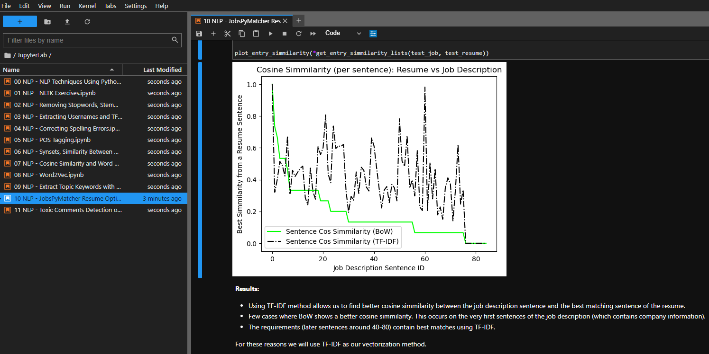

<a name="readme-top"></a>

<!-- PROJECT LOGO -->
<br />
<div align="center">
  <a href="https://github.com/ErnieSumoso/python-development-notebooks">
    
  </a>

<h3 align="center">Python Development Repository</h3>
<b>### Final version - no additional updates planned ###</b> <br><br>
  This repository contains many of my early Python notebooks and coding solutions. From programming exercises, to machine learning, and natural language processing, I have organized everything into different folders for each specific topic.
  <p align="center">
    <br />
    <a href="https://github.com/ErnieSumoso/python-development-notebooks/pulls">Pull Requests</a>
    ·
    <a href="https://github.com/ErnieSumoso/python-development-notebooks/issues">Issues</a>
  </p>
</div>


## About The Project

<div align="center">
  
</div>
This repository was originally created to store and track my progress in programming skills using Python 3. Please note that some of these solutions were programmed a while ago when I was starting my learning journey. Not all solutions have been optimzed and revised, though this repository was an intended way to keep my notebooks organized. All problems were solved using JupyterLab to ease the process of visualizing results and testing. Feel free to explore the files and try other solutions yourself!
<p align="right">(<a href="#readme-top">back to top</a>)</p>


### Built With

* [![Python][python-badge]][python-url]
* [![JupyterLab][jupyter-badge]][jupyter-url]
* [![Anaconda][anaconda-badge]][anaconda-url]

<p align="right">(<a href="#readme-top">back to top</a>)</p>


## Getting Started

As this repository contains mostly Jupyter Notebook files, you only need basic Python and Jupyter software installations.
Using Anaconda Navigator is recommeded, but not required.

### Prerequisites

To run the code you need Python 3 installed on your computer and JupyterLab (or Jupyter Notebook) for file editing.
* [Python 3+](https://www.python.org/downloads/)
* [JupyterLab 4.0+](https://jupyter.org/install) or Jupyer Notebook

### Installation

1. Clone the repo
   ```sh
   git clone https://github.com/ErnieSumoso/python-development-notebooks.git
   ```
2. Explore the files and enjoy!

<p align="right">(<a href="#readme-top">back to top</a>)</p>


## Usage

You can use this repository to solve the problems yourself by trying a different approach, or to explore my own solutions!

These are some resources that helped me practice:

- [Python 3 Documentation](https://docs.python.org/3/)
- [101 NLP Exercises](https://www.machinelearningplus.com/nlp/nlp-exercises/)
- [LeetCode Problems using Python](https://leetcode.com/)

<p align="right">(<a href="#readme-top">back to top</a>)</p>

## Roadmap
- [✓] Upload the most recent versions of the notebooks.
- [✓] Follow file naming conventions, and remove redundant content.
- [✓] Complete the last project updates.

I am always open for any suggestions or new exercises to solve next. Please, add them on the [issues section](https://github.com/ErnieSumoso/python-development-notebooks/issues).

<p align="right">(<a href="#readme-top">back to top</a>)</p>

<!-- CONTACT -->
## Contact
Ernie Sumoso - [GitHub Profile](https://github.com/ErnieSumoso) - [My Repositories](https://github.com/ErnieSumoso?tab=repositories)

<!-- MARKDOWN LINKS & IMAGES -->
[python-badge]: https://img.shields.io/badge/python-3670A0?style=for-the-badge&logo=python&logoColor=ffdd54
[python-url]: https://www.python.org/
[jupyter-badge]: https://img.shields.io/badge/jupyter-book-orange?logo=data:image/png;base64,iVBORw0KGgoAAAANSUhEUgAAABwAAAAZCAMAAAAVHr4VAAAAXVBMVEX////v7+/zdybv7+/zdybv7+/zdybv7+/zdybv7+/zdybv7+/zdybv7+/zdybv7+/zdybv7+/zdybv7+/v7+/zdybv7+/zdybv7+/v7+/zdybv7+/zdybv7+/zdyaSmqV2AAAAHXRSTlMAEBAgIDAwQEBQUGBgcHCAgJCQoLCwwMDQ4ODw8MDkUIUAAADJSURBVHjaddAFkgNBCAXQP+7uAvc/5tLFVseYF8crUB0560r/5gwvjYYm8gq8QJoyIJNwlnUH0WEnART6YSezV6c5tjOTaoKdfGXtnclFlEBEXVd8JzG4pa/LDql9Jff/ZCC/h2zSqF5bzf4vqkgNwEzeClUd8uMadLE6OnhBFsES5niQh2BOYUqZsfGdmrmbN+TMvPROHUOkde8sEs6Bnr0tDDf2Roj6fmVfubuGyttejCeLc+xFm+NLuLnJeFAyl3gS932MF/wBoukfUcwI05kAAAAASUVORK5CYII=
[jupyter-url]: https://jupyter.org/
[anaconda-badge]: https://img.shields.io/badge/Anaconda-44A833?logo=anaconda&logoColor=fff&style=for-the-badge
[anaconda-url]: https://www.anaconda.com/products/navigator
